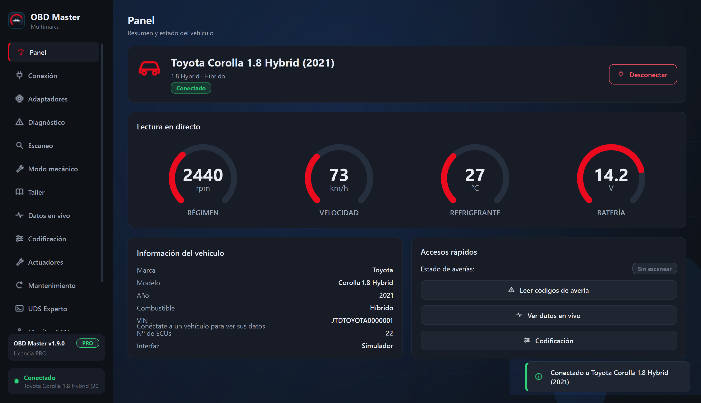
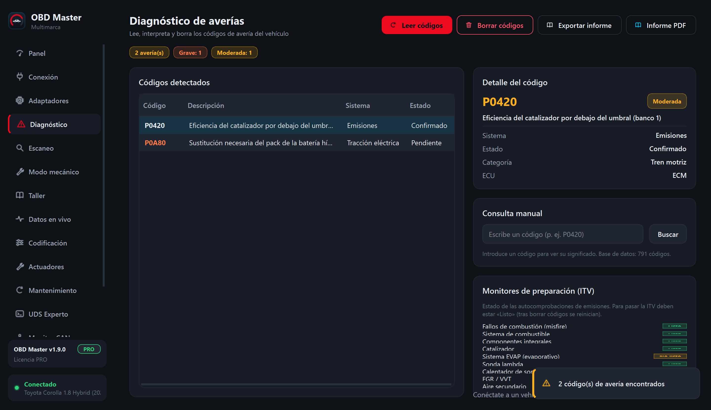
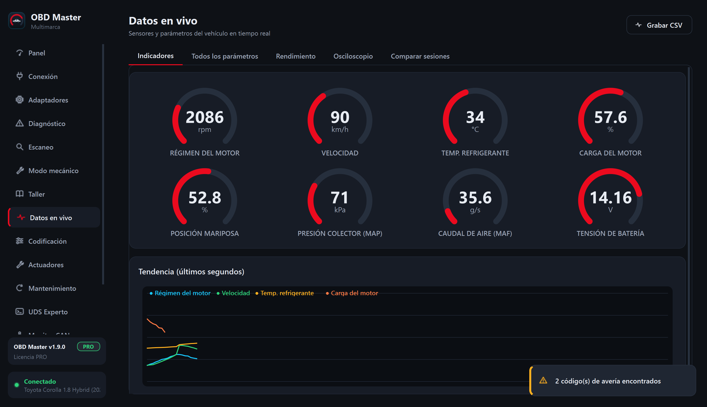
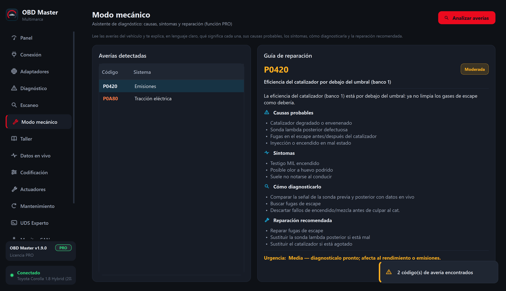
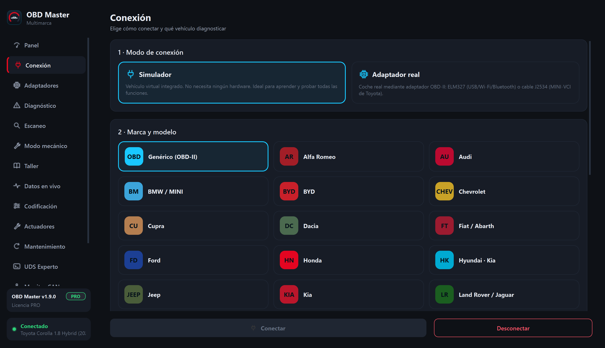
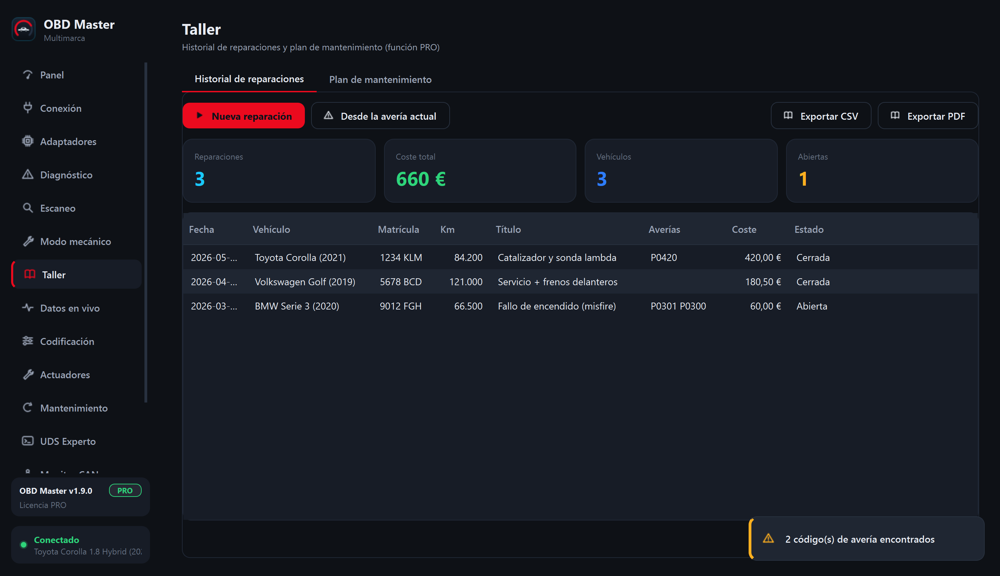
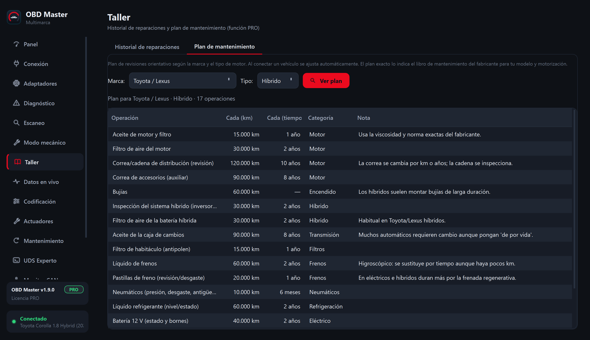

<h1 align="center">🚗 OBD Master</h1>

<b>Diagnóstico y codificación de vehículos · Multimarca · Windows</b>

  
  
  
  

OBD Master es una aplicación profesional de **diagnóstico y codificación de coches**,
una alternativa moderna e intuitiva a herramientas como TechStream, VCDS o DDT4All.
Compatible con adaptadores **ELM327** (USB / Bluetooth / Wi-Fi) e interfaces **J2534**,
y preparada para los vehículos más recientes (**CAN-FD / DoIP**).

---

## ⬇️ Descargar

Descarga la última versión desde **[Releases »](https://github.com/Rannden-SHA/OBD-Master/releases/latest)**

- **`OBD-Master-Setup-X.Y.Z.exe`** — instalador para Windows (64 bits).

La aplicación se **actualiza sola**: te avisa cuando hay una versión nueva y la instala con un clic.

---

## ✨ Qué puede hacer

- 🔧 **Lectura y borrado de averías (DTC)** con base de datos en español (cientos de códigos).
- 🩺 **Modo mecánico**: para cada avería te explica qué significa, sus **causas**, **síntomas**, **cómo diagnosticarla** y la **reparación** recomendada.
- 📊 **Datos en vivo**: indicadores, gráficas de tendencia y **osciloscopio**.
- 🔁 **Comparador de sesiones** grabadas (antes/después de una reparación).
- 🔎 **Escaneo completo** de centralitas (Auto Scan).
- ⚙️ **Codificación y adaptaciones** y **pruebas de actuadores**.
- 🛠️ **Mantenimiento**: reinicios de servicio guiados (aceite, EPB, FAP/DPF, SAS…).
- 📒 **Taller**: historial de reparaciones + plan de mantenimiento por marca, con exportación a **CSV/PDF**.
- 💻 **Consola UDS experta** (ISO 14229), **monitor CAN** e informes de salud en **PDF**.
- 🧰 Multimarca: **35 fabricantes**, incluidos híbridos y eléctricos modernos.

---

## 📸 Capturas

| Diagnóstico de averías | Datos en vivo |
|:--:|:--:|
|  |  |
| **Modo mecánico** | **Conexión multimarca** |
|  |  |
| **Taller · historial** | **Taller · mantenimiento** |
|  |  |

---

## 🚘 Marcas compatibles

Alfa Romeo · Audi · BMW · BYD · Chevrolet · Cupra · Dacia · Fiat · Ford · Honda ·
Hyundai · Jeep · Kia · Land Rover / Jaguar · Lynk & Co · Mazda · Mercedes-Benz ·
MG · MINI · Mitsubishi · Nissan · Opel · Peugeot / Citroën (PSA) · Polestar ·
Porsche · Renault · SEAT · Škoda · Subaru · Suzuki · Tesla · Toyota / Lexus ·
Volkswagen · Volvo · *(y genérico OBD-II)*.

> Incluye eléctricos modernos como el **Toyota C-HR+** y **bZ4X** (diagnóstico **ZEV
> sobre UDS / SAE J1979-3** por **CAN-FD**), Polestar, Taycan, e-tron, EV6, etc.

---

## 🔒 Código fuente

El **código fuente de la aplicación es privado**. Este repositorio se utiliza
únicamente para distribuir las versiones (instaladores) y las actualizaciones
automáticas.

---

## 📄 Licencia y contacto

Software propietario. © 2026 **Rannden** · NextCode Agency. Todos los derechos
reservados. Consulta el archivo [LICENSE](LICENSE) (condiciones de uso).

📧 Soporte y licencias: **a.gisbert@nextcodeagency.com**
